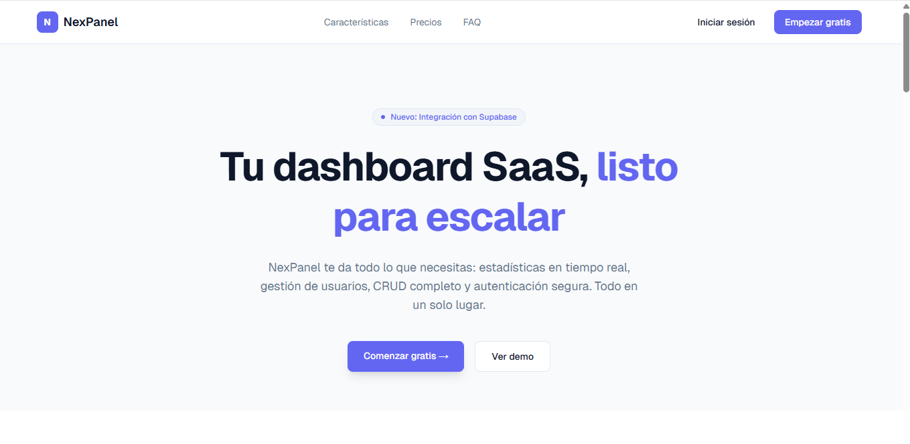
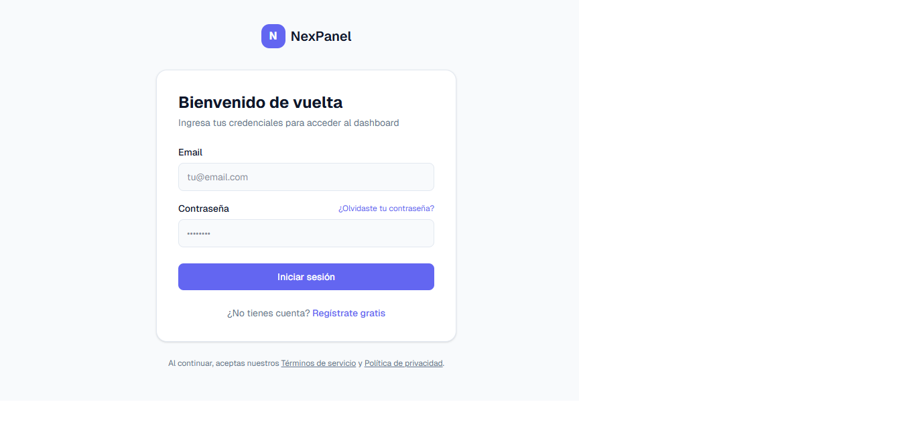
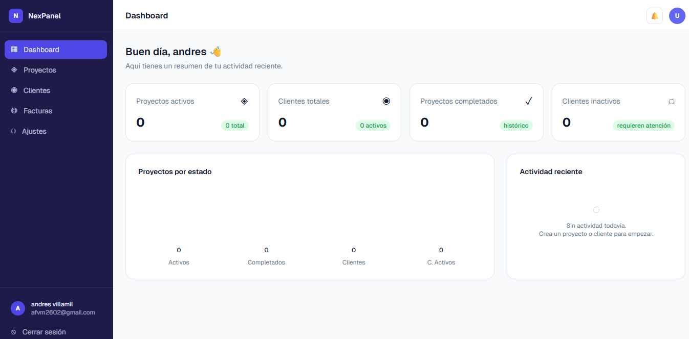
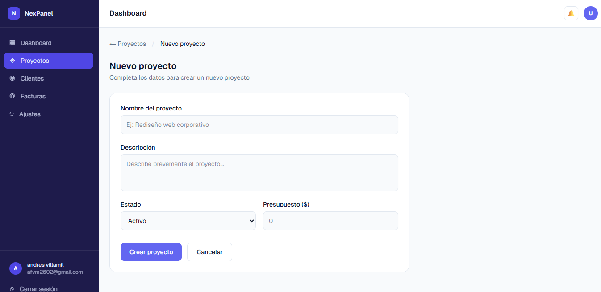
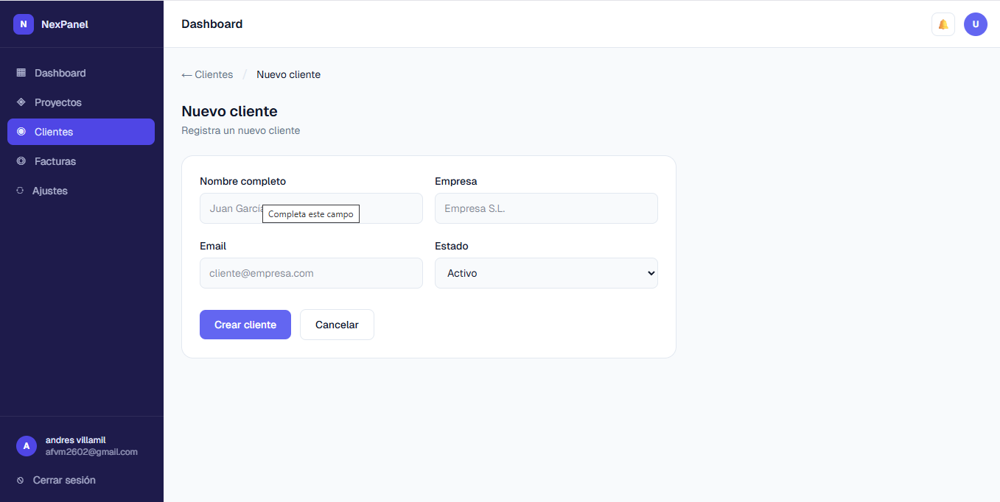
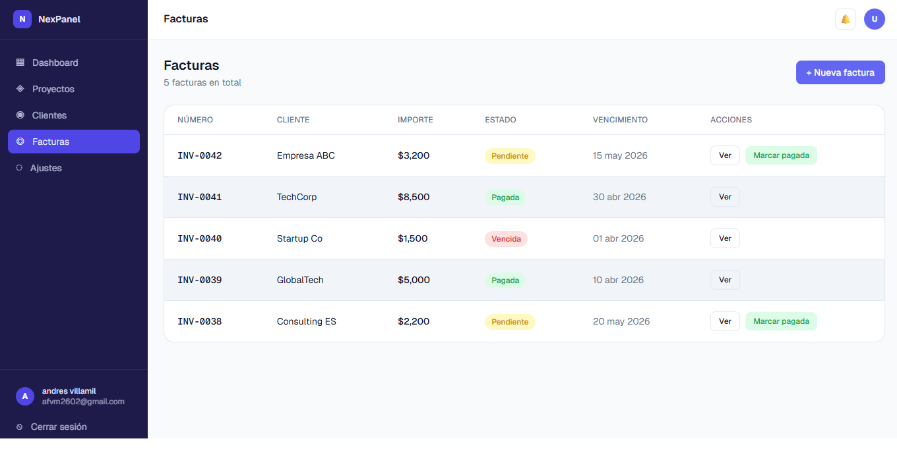

<div align="center">


# NexPanel

**SaaS Dashboard moderno construido con Next.js 16, Tailwind CSS v4 y Supabase**

[](https://nextjs.org)
[](https://tailwindcss.com)
[](https://supabase.com)
[](https://www.typescriptlang.org)

[**Ver Demo →**](https://nexpanel-one.vercel.app) &nbsp;·&nbsp; [Reportar un bug](https://github.com/Andresito2602/nexpanel/issues)

</div>

---

## ¿Qué es NexPanel?

NexPanel es un **SaaS dashboard** de portfolio construido como proyecto de demostración para Fiverr. Incluye todo lo que un cliente esperaría de una aplicación web moderna: autenticación segura, gestión de datos en tiempo real, operaciones CRUD completas y una interfaz limpia y responsive.

Está pensado para mostrar dominio del stack **Next.js App Router + Supabase** con patrones de producción reales: Server Actions, Row Level Security, protección de rutas con middleware y gestión de sesiones con cookies HttpOnly.

---

## Screenshots

| Landing Page | Login | Dashboard |
|---|---|---|
|  |  |  |

| Proyectos | Clientes | Facturas |
|---|---|---|
|  |  |  |

---

## Características

- 🔐 **Autenticación completa** — registro, login y logout con Supabase Auth
- 🛡️ **Rutas protegidas** — middleware que redirige usuarios no autenticados
- 📊 **Dashboard con KPIs** — estadísticas en tiempo real desde la base de datos
- 📁 **Proyectos** — CRUD completo con estados (activo, pausado, completado)
- 👥 **Clientes** — gestión de clientes con empresa y estado
- 🧾 **Facturas** — listado con estados (pagada, pendiente, vencida)
- ⚡ **Actividad reciente** — feed en tiempo real de los últimos eventos
- 🔒 **Row Level Security** — cada usuario solo accede a sus propios datos
- 📱 **Responsive** — adaptado a móvil, tablet y escritorio

---

## Tecnologías

| Tecnología | Versión | Uso |
|---|---|---|
| [Next.js](https://nextjs.org) | 16 | Framework — App Router, Server Actions, Middleware |
| [React](https://react.dev) | 19 | UI — Server Components, `useActionState`, `useTransition` |
| [Tailwind CSS](https://tailwindcss.com) | v4 | Estilos — CSS variables, diseño responsive |
| [Supabase](https://supabase.com) | 2 | Base de datos PostgreSQL, Auth, Row Level Security |
| [@supabase/ssr](https://supabase.com/docs/guides/auth/server-side/nextjs) | 0.10 | Gestión de sesiones con cookies en el servidor |
| [TypeScript](https://www.typescriptlang.org) | 5 | Tipado estático en todo el proyecto |

---

## Estructura del proyecto

```
src/
├── app/
│   ├── (marketing)/        # Landing page pública
│   ├── (auth)/             # Login y registro
│   │   ├── login/
│   │   └── register/
│   └── (dashboard)/        # Rutas protegidas
│       └── dashboard/
│           ├── page.tsx    # KPIs y actividad reciente
│           ├── projects/   # CRUD proyectos
│           ├── clients/    # CRUD clientes
│           ├── invoices/
│           └── settings/
├── components/
│   ├── auth/               # Formularios de autenticación
│   └── dashboard/          # Sidebar, topbar, tablas, cards
├── lib/
│   ├── actions/            # Server Actions (auth, projects, clients)
│   ├── supabase/           # Clientes server/browser, middleware, queries
│   └── definitions.ts      # Tipos TypeScript compartidos
├── middleware.ts            # Protección de rutas
supabase/
└── schema.sql              # Tablas y políticas RLS
```

---

## Correr localmente

### Requisitos

- Node.js 18+
- Una cuenta en [Supabase](https://supabase.com) (plan gratuito)

### 1. Clonar el repositorio

```bash
git clone https://github.com/Andresito2602/nexpanel.git
cd nexpanel
```

### 2. Instalar dependencias

```bash
npm install
```

### 3. Configurar variables de entorno

```bash
cp .env.local.example .env.local
```

Edita `.env.local` con tus credenciales de Supabase:

```env
NEXT_PUBLIC_SUPABASE_URL=https://tu-proyecto.supabase.co
NEXT_PUBLIC_SUPABASE_ANON_KEY=tu_publishable_key
```

Las encuentras en: **Supabase Dashboard → Settings → API Keys**

### 4. Crear las tablas en Supabase

En **Supabase Dashboard → SQL Editor**, ejecuta el contenido de [`supabase/schema.sql`](./supabase/schema.sql).

Esto crea las tablas `projects` y `clients` con Row Level Security activado.

### 5. Arrancar el servidor

```bash
npm run dev
```

Abre [http://localhost:3000](http://localhost:3000) y regístrate para empezar.

---

## Despliegue en Vercel

[](https://vercel.com/new/clone?repository-url=https://github.com/Andresito2602/nexpanel)

1. Importa el repositorio en [vercel.com](https://vercel.com)
2. Añade las variables de entorno (`NEXT_PUBLIC_SUPABASE_URL` y `NEXT_PUBLIC_SUPABASE_ANON_KEY`)
3. Deploy — Vercel detecta Next.js automáticamente

**Demo en producción:** [https://nexpanel-one.vercel.app](https://nexpanel-one.vercel.app)

---

## Licencia

MIT — libre para usar como base o referencia en tus proyectos.

---

<div align="center">
  Construido por <a href="https://github.com/Andresito2602">Andresito2602</a>
</div>
